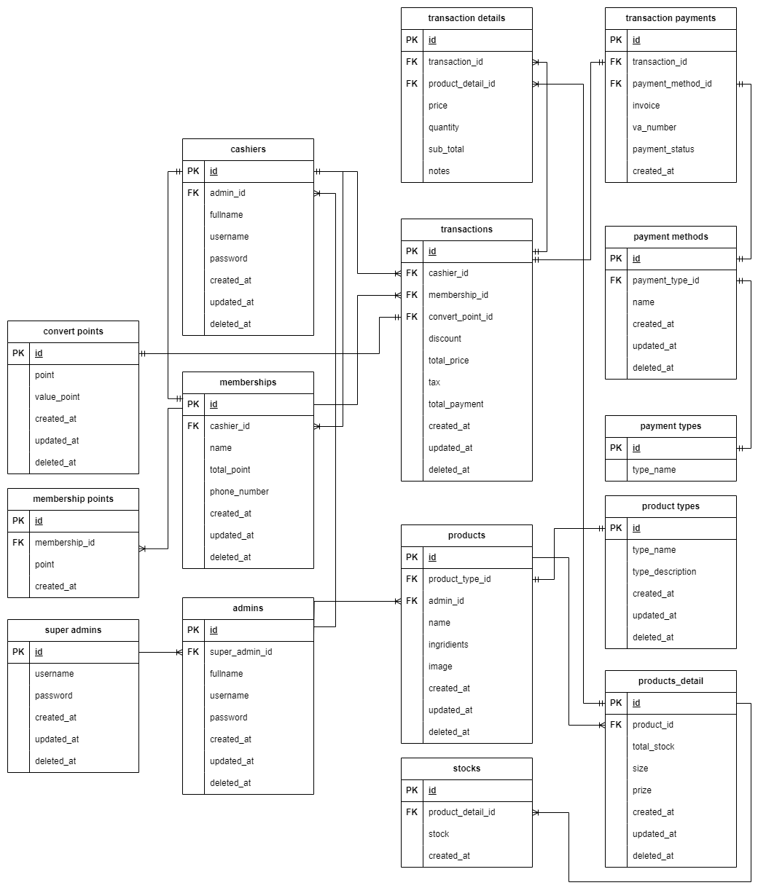

PROJECT CAPSTONE KELOMPOK 10
Alterra Academy
Application POINT OF SALES

# Qbills - API

QBills application is a point of sales application that is an innovative solution in transaction and payment management. Integrated with Midtrans payment gateway, QBills offers secure payment methods, such as Cash, Qris and bank transfer. Transaction management features, real-time transaction monitoring, and real-time payment status make QBills a good choice for point of sales applications. Intuitive user interface and guaranteed data security complete a smooth user experience. QBills ensures an efficient and structured payment and transaction management process, improving customer satisfaction and optimizing your business operations. Experience the ease of QBills to manage transactions and payments optimally!

## Features

### 1. Cashier

- Login Accounts
- Access items
- Create customer orders
- Perform transaction for the customer orders (with manual transfer)
- View payment status
- Perform transaction for orders via payment gateway
- Get payment status in real-time
- Download receipt of payment file in format pdf

### 2. Admin

- Dashboard
- Manage cashier accounts
- Manage memberships
- Manage items
- View transactions
- Print membership card in PDF format
- View transactions in real-time

### 3. SuperAdmin

- Manage Admin account

## Tech Stack

- [Echo](https://echo.labstack.com/): Web Framework
- [Gorm](https://gorm.io/): Golang ORM
- [MySQL](https://www.mysql.com/): Relational Database
- [Docker](https://www.docker.com/): Containerization
- [GCP](https://cloud.google.com//): Cloud Platform Deployment
- [Firebase](https://firebase.google.com/): FileStorage
- [Midtrans](https://midtrans.com/): Payment Gateway
- [CleanArchitecture](https://github.com/Aszaychik/go-simple-clean-rest-api.git): Code Structure
- [Git](https://git-scm.com/): Version Control
- [JWT](https://jwt.io/): Authentication
- [AI](https://platform.openai.com/playground): AI Recommendation
- [Barcode](https://pkg.go.dev/github.com/boombuler/barcode): Barcode Generator Library

## Installation

- Clone a Repository

```bash
git clone https://github.com/Capstone-Kelompok10-POS/QBILLS-BE.git
```

- Get & Install All Dependencies

```bash
go mod tidy
```

## File Environment `.env.example`

The `.env.example` file is an example configuration file used in this project. It contains a list of environment variables that must be set in the actual `.env` file to run the project correctly. Please copy this file as a reference to set the appropriate environment variables.

### Required Environment Variables

Here is the list of environment variables required in the file`.env`:

1. **DB_USER**: The database user name.
2. **DB_PASSWORD**: Database user password.
3. **DB_HOST**: The database host.
4. **DB_PORT**: Port database.
5. **DB_NAME**: The name of the database used.
6. **SECRET_KEY**: Secret key for JWT Middleware
7. **SALT**: Salt for hashing passwords
8. **OPENAI_KEY**: OPEN AI KEY for diagnostics with OpenAI
9. **MIDTRANS_SERVER_KEY**: MIDTRANS_SERVER_KEY for connect with Midtrans
10. **MAIN_URL**: This Main Url For Pagination
11. **API_VERSION**: This API Version

### How to use `.env.example`

- Duplicate the `.env.example` file as `.env` and create it automatically if it is not already available

  ```bash
  cp -n .env.example .env
  ```

- Fill in the environment variable values in `.env` with your own environment

## ERD


[View Full ERD](https://drive.google.com/file/d/1egsk7TcPV5pxvX0Yx-vPoiYNioB2mYDH/view?usp=sharing)

## API Documentation

Explore Qbills API using our [Postman Documentation](https://www.postman.com/qbills/workspace/qbills-api-v1/collection/24198072-2a018155-b2a7-4814-a6ac-5c9cdcd71cf4?action=share&creator=24198072&active-environment=24198072-76650fdc-2796-4ed9-a489-0ea45cfbe5ca).
